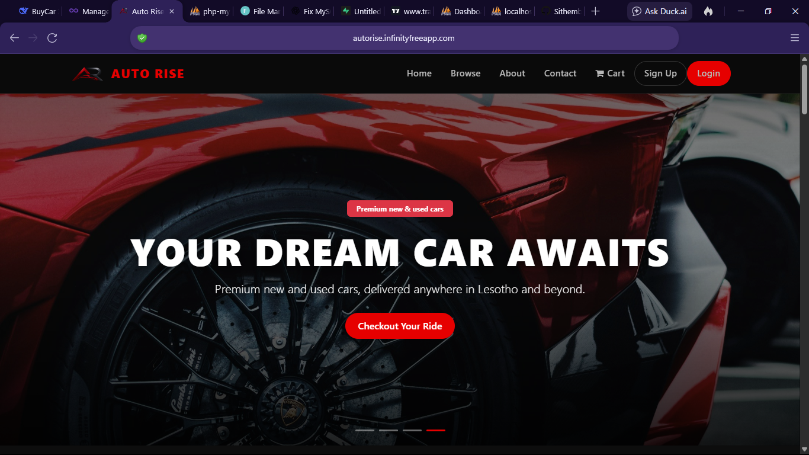
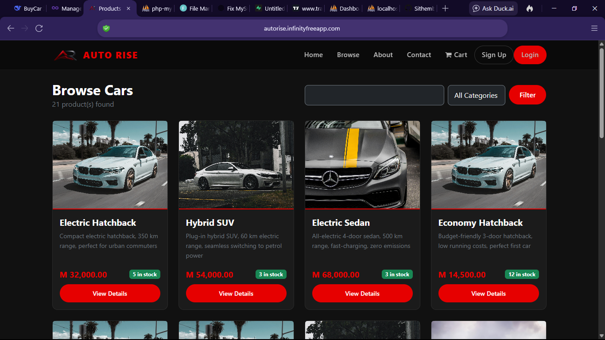
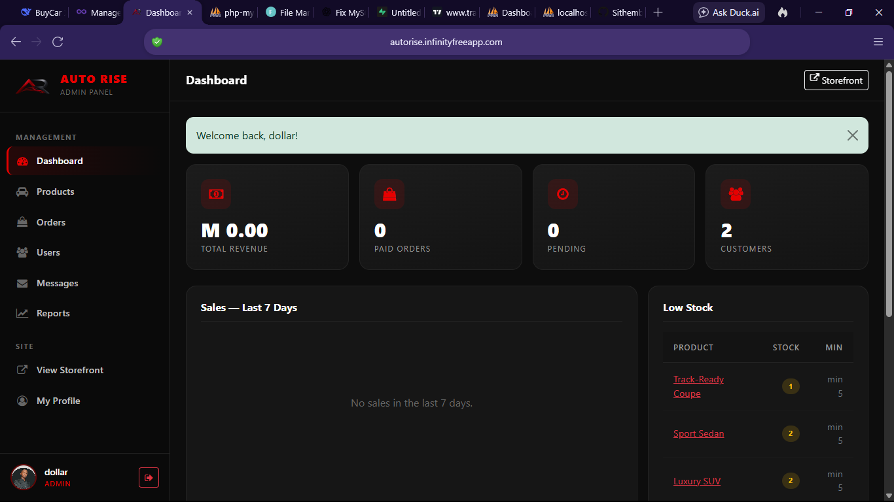
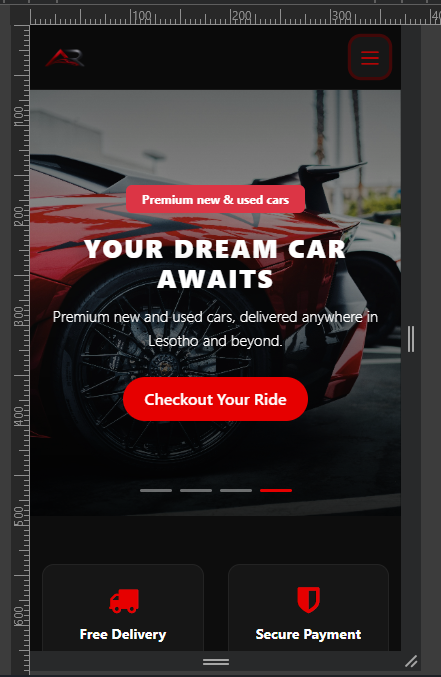

# Auto Rise

> A modern e-commerce platform for premium new and used cars. Built with vanilla PHP 8.2, MySQL/SQLite, and Bootstrap 5.

[](https://autorise.infinityfreeapp.com/)
[](https://www.php.net/)
[](https://www.mysql.com/)
[](https://www.sqlite.org/)
[](#testing)


---

## Live Demo

**🌐 [https://autorise.infinityfreeapp.com/](https://autorise.infinityfreeapp.com/)**

Admin credentials available on request.

---

## Table of Contents

- [Features](#features)
- [Tech Stack](#tech-stack)
- [Screenshots](#screenshots)
- [Requirements](#requirements)
- [Local Setup](#local-setup)
- [Project Structure](#project-structure)
- [CLI Tools](#cli-tools)
- [Database Mirror](#database-mirror)
- [Testing](#testing)
- [Security](#security)
- [Deployment](#deployment)
- [Contributing](#contributing)
- [License](#license)
- [Author](#author)

---

## Features

### Storefront
- Hero image slider with auto-rotation and dot indicators
- Product browsing with pagination, search, and category filters
- Product detail pages with image gallery
- Responsive design for mobile, tablet, and desktop
- Rich landing page with FAQs, trust badges, and newsletter

### Shopping
- Session-backed cart (add, update, remove)
- Atomic stock decrement during checkout — no oversell
- Order history and order detail pages
- Payment abstraction layer (Mock gateway + Stripe-ready)

### Authentication & Users
- Unified login/register for customers and staff
- Brute-force protection (5 attempts / 15 minutes)
- Password reset via token (email link)
- Profile page with order stats, avatar upload, and password change
- Session hardening (fingerprint binding, idle timeout, periodic regeneration)

### Admin Panel
- Dashboard with KPIs, sales chart, low stock alerts, top products
- Product CRUD with image upload, soft delete, and restore
- Order management with status history and notes
- User role management (customer / staff / manager / admin)
- Reports with range selector (7 / 30 / 90 / 365 days)
- Contact messages inbox with status workflow

### Platform
- **Two-engine database** — MySQL primary with SQLite mirror + silent fallback
- **Structured logging** — Monolog with daily rotation
- **Error handling** — Styled 404 / 403 / 419 / 500 pages
- **Audit trail** — Every admin action logged to `admin_logs`
- **CLI tooling** — Backups, cache clearing, health checks, security audits

---

## Tech Stack

| Layer | Technology |
|---|---|
| **Language** | PHP 8.2 (strict types) |
| **Database** | MySQL 8 / MariaDB 10.4+ / SQLite 3 |
| **Frontend** | Bootstrap 5, custom CSS, vanilla JS |
| **Icons** | Font Awesome 4.7 |
| **HTTP** | Apache + mod_rewrite (Nginx compatible) |
| **Dependencies** | Composer 2 |
| **Logging** | Monolog 3 |
| **Environment** | vlucas/phpdotenv |
| **Testing** | PHPUnit 10 |
| **Deployment** | Docker / Railway / cPanel / VPS |

---

## Screenshots

### Homepage


### Product Listing


### Admin Dashboard


### Mobile View


*(Add screenshots to `docs/screenshots/` to make these load.)*

---

## Requirements

- **PHP** 8.1+ (tested on 8.2)
- **MySQL** 5.7+ or **MariaDB** 10.4+ (or SQLite 3.35+ for mirror mode)
- **Composer** 2.x
- **Apache** with `mod_rewrite`, `mod_headers`, `mod_expires` — or **Nginx** equivalent
- **Extensions:** `pdo_mysql`, `pdo_sqlite`, `openssl`, `mbstring`, `json`, `curl`, `gd`

---

## Local Setup

```bash
# 1. Clone
git clone https://github.com/YOUR_USER/autorise.git
cd autorise

# 2. Install dependencies
composer install

# 3. Copy env and generate a key
cp .env.example .env
php -r "echo 'APP_KEY=base64:' . base64_encode(random_bytes(32)) . PHP_EOL;"
# Paste the output into .env

# 4. Create the database
mysql -u root -e "CREATE DATABASE shop_system CHARACTER SET utf8mb4;"

# 5. Import migrations (in order)
for f in database/migrations/*.sql; do
    mysql -u root shop_system < "$f"
done

# 6. Build the SQLite mirror (optional)
php tools/build_sqlite.php
php tools/sync_mysql_to_sqlite.php

# 7. Run tests to confirm everything works
composer test